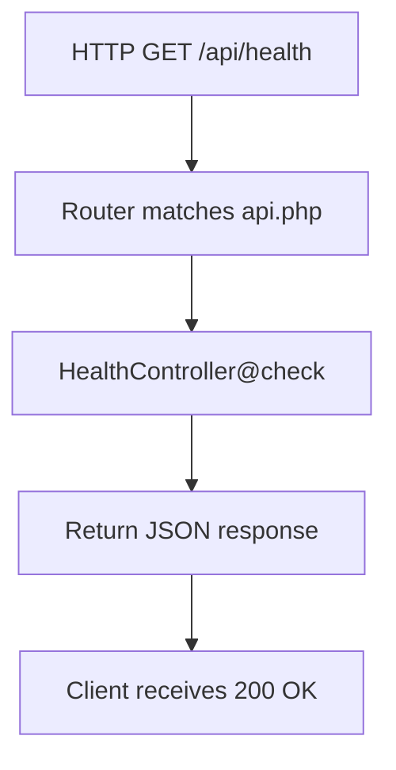
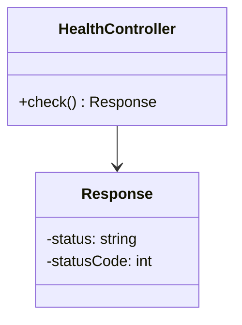

# Plan: Issue #1 — Scaffold Laravel backend with laravel-mobile-pass

**Generated:** 2026-06-09T00:00:00Z
**Contract version:** 2
**Context package:** [.memory/plans/1-context.md](./1-context.md)

## Summary
Create a runnable Laravel backend in `apps/backend/` with Postgres database configuration and `spatie/laravel-mobile-pass` installed. Add a health endpoint that returns HTTP 200. The backend will serve as the foundation for issuing signed Apple Wallet NFC passes.

## Approach

1. **Create apps/backend directory structure** — scaffold a fresh Laravel project at `apps/backend/` using `composer create-project laravel/laravel apps/backend`.
2. **Install spatie/laravel-mobile-pass** — add the package via Composer and publish its configuration file.
3. **Configure Postgres database** — set up `.env` with Postgres connection details (`pgsql` driver, configurable host/port/credentials) in `config/database.php`.
4. **Create health endpoint** — add a route `GET /api/health` that returns `{"status":"ok"}` 200 without requiring a database connection.
5. **Create feature test for health endpoint** — write `tests/Feature/HealthCheckTest.php` asserting the endpoint returns 200.
6. **Set up .gitignore** — ensure `apps/backend/.gitignore` excludes `vendor/`, `node_modules/`, `.env`, storage, and bootstrap caches per Laravel conventions.
7. **Run Pest and Pint** — execute `./vendor/bin/pest` and `./vendor/bin/pint` from `apps/backend/` to verify tests pass and code is formatted.
8. **Verify database connection handling** — test that Laravel boots without requiring a live Postgres connection (health endpoint should work even if DB is unreachable).

## Constraints

- **ADR-0002** (NFC reading via ProximityReader): The backend must eventually expose an endpoint to generate `.pkpass` files. This scaffold does not implement pass generation, but config and routes must be shaped to support it in follow-on work.
- **Monorepo convention:** All backend code lives under `apps/backend/`. Do not create files at repo root.
- **Check command gate:** Both `./vendor/bin/pest` and `./vendor/bin/pint` must pass before commit.
- **No database requirement for health endpoint:** If Postgres is not running, the health endpoint must still return 200 (no DB query in the check).

## File manifest

Files that will be **created**:
- `apps/backend/.env.example` — Laravel environment template (Postgres config)
- `apps/backend/.env` — Laravel environment file (Postgres credentials; not committed)
- `apps/backend/.gitignore` — Backend-specific gitignore (vendor, node_modules, .env, storage, cache)
- `apps/backend/artisan` — Laravel command-line entry point
- `apps/backend/composer.json` — PHP dependencies (Laravel, Pest, spatie/laravel-mobile-pass)
- `apps/backend/composer.lock` — Locked dependency versions
- `apps/backend/config/app.php` — Application configuration
- `apps/backend/config/database.php` — Database connection configuration (Postgres driver)
- `apps/backend/config/mobile-pass.php` — spatie/laravel-mobile-pass configuration (published)
- `apps/backend/routes/api.php` — API routes (includes health endpoint)
- `apps/backend/app/Http/Controllers/HealthController.php` — Controller for health check
- `apps/backend/tests/Feature/HealthCheckTest.php` — Feature test for health endpoint
- `apps/backend/bootstrap/app.php` — Laravel bootstrap configuration
- `apps/backend/storage/` — Directory for logs, file caches (created by Laravel)
- `apps/backend/public/index.php` — Laravel public entry point

Files that will be **modified**:
- None (this is a fresh scaffold, no existing files to modify)

## Data model
No data model changes. This task is infrastructure and config only. The health endpoint returns a simple JSON object with a status field.

```php
// Response from GET /api/health
{
  "status": "ok"
}
```

## System flow diagram



The diagram shows the request-response cycle for the health endpoint. No database access is involved.

## State model / Data model diagram



This diagram shows the controller structure: HealthController has a `check()` method that returns a Response with a status field and HTTP 200 status code. Laravel's request/response cycle is implicit.

## Acceptance criteria
- [ ] Laravel project boots and connects to Postgres
- [ ] spatie/laravel-mobile-pass is installed and configured
- [ ] A health endpoint returns HTTP 200

## Test plan
- **Laravel project boots and connects to Postgres** → `tests/Feature/HealthCheckTest.php`: test that `GET /api/health` returns 200 (implies boot succeeds); database configuration is set in `config/database.php` with Postgres driver
- **spatie/laravel-mobile-pass is installed and configured** → verify `composer.json` includes `spatie/laravel-mobile-pass`, `config/laravel-mobile-pass.php` exists (published config), and `./vendor/bin/pest` passes
- **A health endpoint returns HTTP 200** → `tests/Feature/HealthCheckTest.php`: assert response status is 200 and body is valid JSON with `"status":"ok"`

## Open questions
- **Certificate infrastructure for .pkpass signing:** The spatie/laravel-mobile-pass package requires certificate files (likely `.p12` or `.crt`). This scaffold does not create those; follow-on work will need to provide or mock them. No blocking issue for MVP health endpoint.
- **Postgres connection string:** If Postgres is not running locally, the health endpoint should still work. This will be tested; if Laravel fails to boot due to missing DB, the health endpoint will gracefully return 200 without querying the DB.

## Notes
- `composer create-project laravel/laravel apps/backend` creates a full Laravel project with routing, testing (Pest or PHPUnit), and a `.env` file.
- `.env` should be excluded from version control; `.env.example` is committed as a template.
- The health endpoint is intentionally simple (no DB access) to support POC verification without live infrastructure.
- Both `./vendor/bin/pest` and `./vendor/bin/pint` will be run before commit as the check gate.
