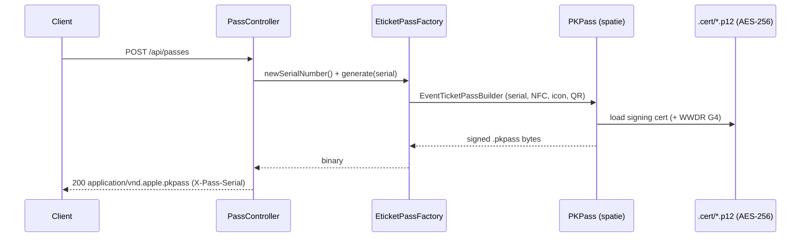
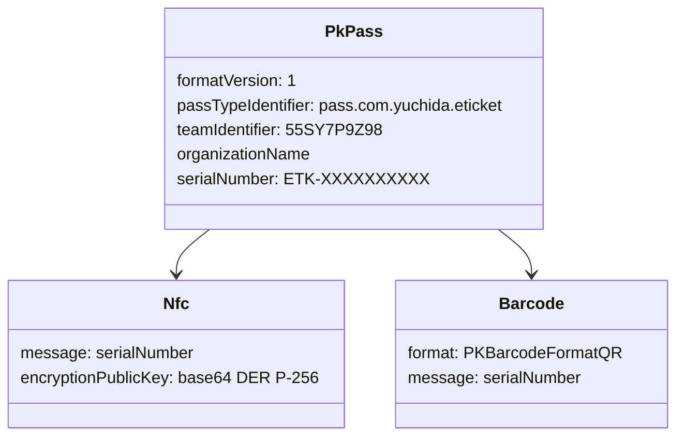

# Plan — Issue #2: Generate a signed Apple Wallet NFC pass via API

## Approach
Expose `POST /api/passes` that builds an **event-ticket** pass via `spatie/laravel-mobile-pass`
(`EventTicketPassBuilder`), signs it with the project's Pass Type ID certificate, and returns the
binary `.pkpass`. Each pass gets a unique serial number, which is mirrored into the pass's **NFC
payload message** and QR barcode so the reader app (#4) can surface it after a tap. The NFC payload
also carries a base64 (DER) P-256 **public** key.

The signing certificate lives in the gitignored repo-root `.cert/`. Apple's `.p12` uses legacy
RC2-40 encryption that OpenSSL 3 / PHP cannot read; it must be re-encrypted to AES-256 once (see
`apps/backend/README.md`). The bundled Apple WWDR (G4) intermediate completes the chain.

## File manifest
| File | Change |
|------|--------|
| `apps/backend/config/passes.php` | New — serial prefix + NFC public-key config. |
| `apps/backend/app/Services/EticketPassFactory.php` | New — assembles/signs the pass; mints serials; resolves the NFC public key. |
| `apps/backend/app/Http/Controllers/PassController.php` | New — `store()` returns the signed `.pkpass`. |
| `apps/backend/routes/api.php` | Add `POST /api/passes`. |
| `apps/backend/resources/passes/icon.png` | New — required PassKit icon asset. |
| `apps/backend/resources/passes/nfc_public_key.b64` | New — committed default NFC public key (not secret). |
| `apps/backend/tests/Feature/PassGenerationTest.php` | New — CI-safe assembly test + cert-gated signed-endpoint test. |
| `apps/backend/.env.example` | Add `ETICKET_SERIAL_PREFIX`, `ETICKET_NFC_PUBLIC_KEY`. |
| `apps/backend/README.md` | Backend README incl. pass-signing setup + legacy `.p12` conversion. |

## System flow

## Pass data model

## Test plan
- **Assembly (CI-safe, no cert):** `EticketPassFactory::builder()->data()` yields `serialNumber`,
  `passTypeIdentifier`, `teamIdentifier`, and a non-empty `nfc.encryptionPublicKey`; serial is
  `ETK-`-prefixed. Apple identifiers injected via `config()` so no real creds are needed.
- **Signed endpoint (cert-gated; skipped when no cert, e.g. CI):** `POST /api/passes` → 200,
  `Content-Type: application/vnd.apple.pkpass`, body is a valid zip containing
  `pass.json`/`manifest.json`/`signature`/`icon.png`, and `pass.json.serialNumber` matches
  `X-Pass-Serial`.
- Verified locally end-to-end: 3.5 KB signed pass, signer `UID=pass.com.yuchida.eticket` →
  Apple WWDR G4.

## ADR / constraints
- ADR-0002 (NFC via ProximityReader native module) is unaffected — this is backend issuance only.
- Worth recording the backend stack + the legacy-`.p12` conversion as **ADR-0003** (follow-up).
