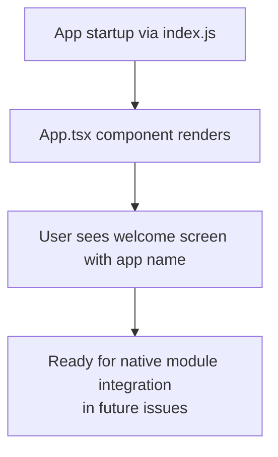
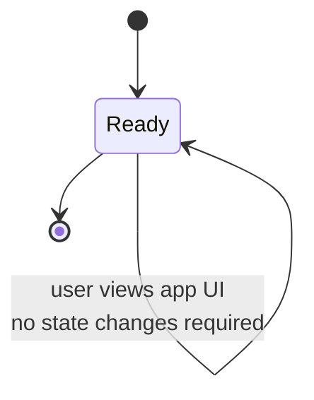

# Plan: Issue #3 — Scaffold Expo app with iOS dev client

**Generated:** 2026-06-09T00:00:00Z
**Contract version:** 2
**Context package:** [.memory/plans/3-context.md](./3-context.md)

## Summary
Scaffold a new Expo application in `apps/mobile/` configured for iOS development with TypeScript, ESLint + Prettier, and Jest. The app uses the dev-client / prebuild workflow (required for future custom native modules per ADR-0002) and includes minimal UI with all tooling wired up and passing `npm run check`.

## Approach

1. Initialize `apps/mobile/` directory structure with `npx create-expo-app --template=expo-template-blank@latest`
2. Configure TypeScript: verify `tsconfig.json` exists and enable strict mode
3. Add `expo-dev-client` dependency to enable custom development client workflow
4. Configure ESLint with a React Native-friendly shareable config (e.g., `@react-native-community/eslint-config`)
5. Configure Prettier with `.prettierrc` to enforce consistent formatting
6. Set up Jest for unit testing with React Native support (via `@testing-library/react-native` and preset)
7. Wire up `package.json` scripts: `check` (typecheck+lint+test), `typecheck` (tsc), `lint` (eslint), `test` (jest)
8. Create a minimal test file (`src/__tests__/App.test.ts`) to satisfy the test criterion and ensure Jest is wired correctly
9. Create a minimal `src/App.tsx` component showing the app structure (single screen, no business logic)
10. Add `apps/mobile/node_modules/` to the repo `.gitignore`
11. Run `npm run check` from `apps/mobile/` and verify all checks pass

## Constraints

- **ADR-0002** (NFC reading via ProximityReader native module): This scaffold must support the dev-client / prebuild workflow, not Expo Go. No third-party NFC libraries will be added at this stage. The native module integration happens in a later issue (#4).
- **Monorepo convention**: All mobile files must live under `apps/mobile/`. No files at repo root. Respect existing `.gitignore` and do not modify root `CLAUDE.md` or `.memory/` workflow files.
- **Check command**: Must run from inside `apps/mobile/` and pass completely (no errors, no warnings at this stage). This gates commit.

## File manifest

Files that will be **created**:
- `apps/mobile/.gitignore` — ignore node_modules, build artifacts, environment files
- `apps/mobile/package.json` — Expo app dependencies and scripts (check, typecheck, lint, test)
- `apps/mobile/package-lock.json` — npm lockfile (auto-generated during install)
- `apps/mobile/tsconfig.json` — TypeScript configuration with strict mode enabled
- `apps/mobile/.eslintrc.json` — ESLint configuration for React Native
- `apps/mobile/.prettierrc` — Prettier configuration (2-space indent, semi)
- `apps/mobile/jest.config.js` — Jest configuration for React Native testing
- `apps/mobile/jest.setup.js` — Jest setup file for testing library
- `apps/mobile/app.json` — Expo app config (prebuild-compatible, includes app id and dev-client)
- `apps/mobile/App.tsx` — minimal root component with basic UI
- `apps/mobile/index.js` — entry point
- `apps/mobile/src/__tests__/App.test.ts` — minimal passing Jest test
- `.memory/plans/3-context.md` — context package (plan commit artifact)
- `.memory/plans/3-plan.md` — this file (plan commit artifact)

Files that will be **modified**:
- `.gitignore` (repo root) — add `apps/mobile/node_modules/` to the existing ignore list

## Data model
No data model changes. The app is a UI shell at this stage with no persisted state or complex data shapes.

## System flow diagram

The system flow shows that the Expo dev client boots, loads the JavaScript bundle, and renders a minimal UI. At this stage, there is no network communication or state management — the focus is on establishing the dev environment and toolchain.

## State model / Data model diagram

The app is stateless at this stage. The Ready state represents the app displaying its initial UI. No transitions occur because the scaffold is a minimal shell; business logic and state will be added when the native module integration begins in issue #4.

## Acceptance criteria
- [ ] Expo app runs on a physical iOS device via the dev client
- [ ] TypeScript is configured and typechecks
- [ ] ESLint + Prettier are wired up

## Test plan
- **Expo app runs on a physical iOS device via the dev client** → Structural: `apps/mobile/app.json` includes `expo-dev-client` plugin, `package.json` includes `expo-dev-client` as a dependency, and `npx expo prebuild` + manual device build is documented. Functional test: `src/__tests__/App.test.ts` renders App component successfully (confirms bundling works).
- **TypeScript is configured and typechecks** → `npm run typecheck` from `apps/mobile/` runs `tsc --noEmit` and exits with code 0 (no type errors).
- **ESLint + Prettier are wired up** → `npm run lint` from `apps/mobile/` runs ESLint and exits with code 0; `.prettierrc` exists and `prettier` is runnable on source files.

## Open questions
None. All acceptance criteria are structural (config + dependencies) and can be verified without a physical device present.
